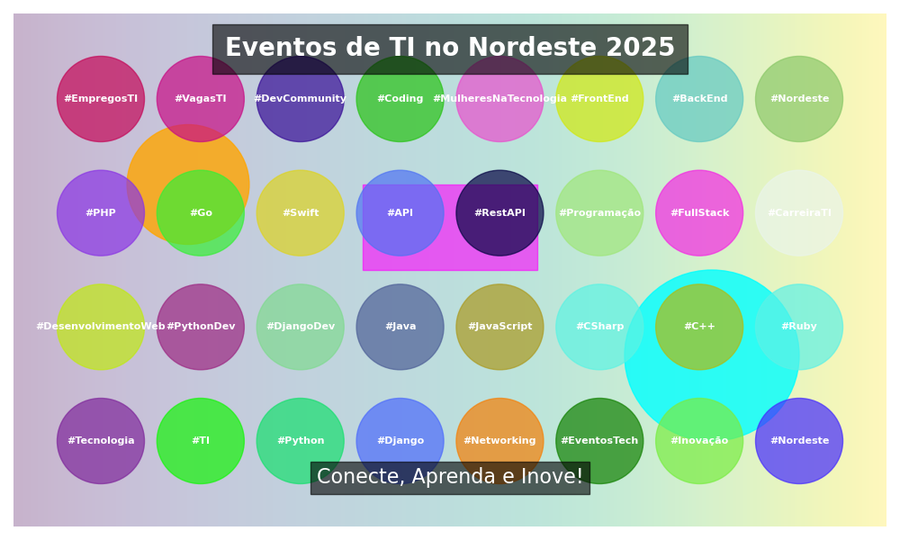

# **Visual Composition with Python**

**Este projeto demonstra como criar uma composição gráfica organizada e visualmente atraente usando Python.**  
A ideia foi desenvolver uma arte que destaque **eventos de TI no Nordeste** para ser utilizada em publicações, como no LinkedIn, além de aprimorar **minhas habilidades técnicas** na criação de gráficos.

## **Visão Geral**

A composição foi gerada utilizando **três bibliotecas principais**:

- **Matplotlib:**  
  Utilizada para criar a figura, desenhar formas (**círculos e retângulos**), inserir textos e salvar a imagem final.  
  A biblioteca é fundamental para a criação de gráficos e visualizações.

- **NumPy:**  
  Usada para operações numéricas, como gerar um fundo com gradiente (através da função `np.linspace`) e calcular espaçamentos uniformes para dispor os elementos na imagem de forma organizada.

- **Random:**  
  Empregada para gerar valores aleatórios que definem posições e cores dos elementos (como os círculos com hashtags), garantindo variações visuais interessantes.

---

## **Funcionalidades**

### **Fundo com Gradiente:**
  Um fundo suave criado a partir de uma matriz numérica, que utiliza o colormap **'viridis'** para um efeito visual moderno.

### **Elementos Artísticos:**
  Formas geométricas (**círculos** e **retângulos**) com cores e transparências definidas para adicionar um toque de design à composição.

### **Textos e Hashtags:**
  Inclusão de um **título**, uma **tagline** e uma série de **hashtags** (que abrangem temas como **tecnologia**, **linguagens de programação** e outras tecnologias) organizadas de maneira uniforme em um grid.

### **Layout Profissional:**
  Distribuição dos elementos em um grid para um visual organizado e balanceado.

---
## **Como Funciona**

### **Criação da Figura:**
  A figura é criada com `plt.subplots()`, definindo o tamanho e os eixos onde os elementos serão desenhados.

### **Fundo com Gradiente:**
  Um gradiente é gerado com `np.linspace` e `np.vstack`, e exibido utilizando `ax.imshow()` com transparência ajustada.

### **Desenho das Formas:**
  São desenhados dois **círculos** e um **retângulo** com cores predefinidas, utilizando `plt.Circle` e `plt.Rectangle`.

### **Inserção de Texto:**
  O **título** e a **tagline** são adicionados com `ax.text()`, utilizando caixas de fundo para melhor visibilidade.

### **Disposição das Hashtags:**
  As **hashtags** são organizadas em um grid uniforme, calculado a partir do número total de tags e do espaçamento definido para os eixos, garantindo uma disposição equilibrada.

### **Exibição e Salvamento:**
  A imagem final é ajustada com `plt.tight_layout()`, salva em um arquivo (**"minha_imagem.png"**) e exibida com `plt.show()`.

---
## **Como Executar**

  Certifique-se de ter as bibliotecas necessárias instaladas:
    ```bash
    pip install matplotlib numpy

  Em seguida, execute o script:
    ```bash
    python seu_script.py

## **Exemplo de Saída**


